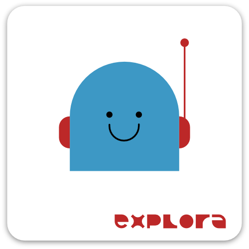

# Radio Kids



[](https://mdbr.it/en/) [](https://en.wikipedia.org/wiki/Web_application)

*Radio Kids* is a web application that emulate the functioning of a simplified radio boot featuring the **selection of a sound file** from a library, the **recording thorugh mic device** and allowing to **play** both sequentially.

- [Introduction](#introduction)
- [Development](#development)
- [Project additional infos](#infos)

## <a name="introduction"></a>Introduction

*Radio kids* features a button interface to choose which action to perform, a recording system and an audio player system.
The application is based on **progessive interfaces, each for an action** (read [How it works](#how-it-works) for more informations)
The user can record his voice and to choose a sound file.
When user launches it, the application plays the recording and then the audio, mimicking a radio speaker.

### <a name="how-it-works"></a>How it works

1. Start screen
2. Instruction screen
3. Song choice screen
   - Song list
   - Song playback
4. Confirmation of the chosen song
5. Record screen
   - Record button
   - Record playback
6. Rec screen (starts a countdown)
7. On Air screen (automatically plays recording + audiofile)
8. End screen

*Every time user is satisfied from the completion of a task in a screen, has to hit a “Next button” to move to next screen*

## <a name="development"></a>Development

### Dependencies:
- [p5.js](https://github.com/processing/p5.js)
- [p5.sound](https://github.com/processing/p5.js-sound)
- [jQuery](https://github.com/jquery/jquery) 
  
All the dependencies already come with the repository (in `./public` folder). Just clone it and run `main.py` :

```bash
# Clone repo
git clone https://github.com/ExploraMDBR/radio-kids.git

# Start local server
python3 main.py # prints localhost:<port> to console (port number is randomly generated each launch)

# The application is now running and can be accessed at localhost:<port>
```
## <a name="infos"></a>Project additional infos

### Project purpose

*Radio kids* is designed as an installation. It features a full size booth (equipped with an interactive console, speakers and other props).
The kids can experiment with audio, recording and music, in an immersive experience enhanced by the storytelling of being a DJ or a radio-speaker.


### Related Explora's project

- [Next stop Explora]()
